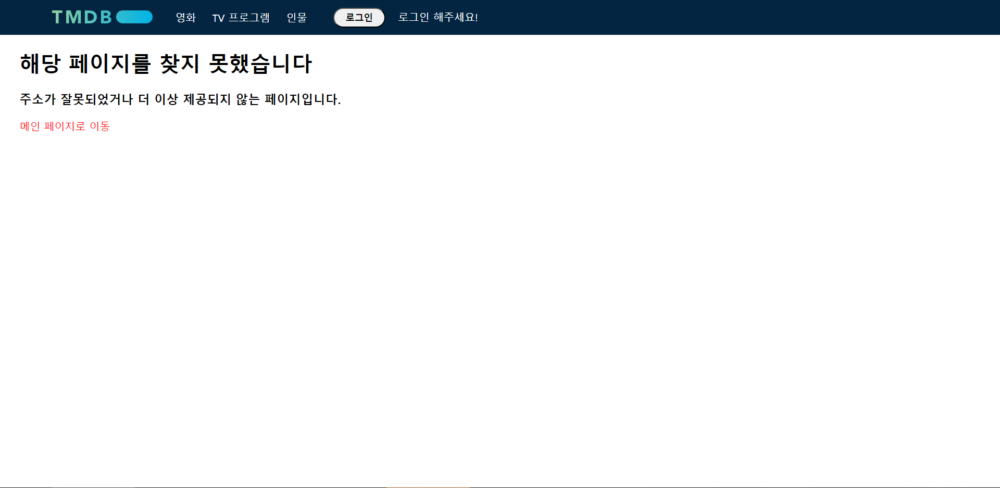

# Chapter 6. LifeCycle & Hook

Mission : 
1. 로그인, 로그아웃 버튼을 누름에 따라 다른 문구, 버튼을 출력하도록 useState 활용  
2. 잘못된 주소를 입력했을 때 메인 페이지로 돌아갈 수 있게 해주는 페이지 컴포넌트 구현  

[구현 page link](https://promleemissionch6.netlify.app/)  

  